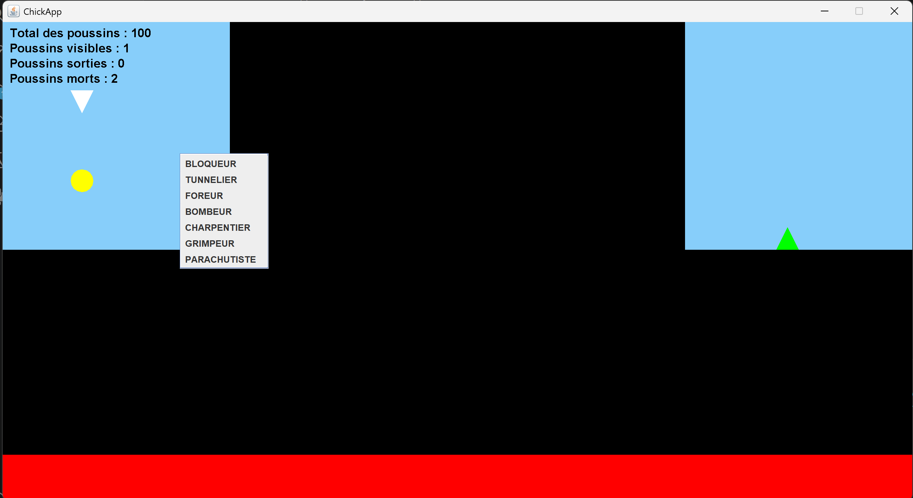

# 🐥 ChickApp

> Clone de *Lemmings* en Java — sauvez vos poussins !

---

## Présentation

**ChickApp** est un jeu de réflexion inspiré de *Lemmings*, développé en Java avec Swing.  
Des poussins apparaissent un par un depuis un portail d'entrée et marchent tout droit, sans se soucier du danger. Votre rôle : leur assigner des tâches pour les guider jusqu'au portail de sortie, en évitant la lave et les chutes mortelles.



---

## Aperçu du gameplay

```
[Portail entrée] ──► poussins marchent automatiquement ──► [Portail sortie]
                          ↓ obstacles, vide, lave ↓
              Le joueur assigne des tâches pour les sauver
```

- **100 poussins** apparaissent progressivement (1 par seconde)
- Chaque poussin qui tombe de plus de **5 cases** meurt
- La partie se termine quand tous les poussins ont disparu ou atteint la sortie

---

## Tâches disponibles

| Tâche | Rôle |
|---|---|
| 🧱 **Bloqueur** | Devient un obstacle fixe, fait demi-tour aux autres |
| ⛏️ **Foreur** | Creuse vers le bas (5 cases) |
| 🔨 **Charpentier** | Construit un escalier de 5 marches vers l'avant |
| 🪖 **Tunnelier** | Perce un tunnel dans le mur devant lui |
| 🧗 **Grimpeur** | Escalade les murs au lieu de faire demi-tour |
| 🪂 **Parachutiste** | Ralentit la chute, survit aux grandes hauteurs |
| 💣 **Bombeur** | Explose après 3 pas, détruit les obstacles alentour (et meurt) |

---

## Architecture MVC

```
src/
├── app/
│   └── Main.java                  # Point d'entrée, initialisation Swing
│
├── model/
│   ├── GameState.java             # Snapshot immuable de l'état du jeu
│   ├── SelectionModel.java        # Tâche sélectionnée par le joueur
│   ├── characters/
│   │   ├── GameCharacter.java     # Entité personnage (position, état, tâche)
│   │   ├── CharacterObserver.java # Interface observer (mort / sortie)
│   │   ├── PhysicsHelper.java     # Utilitaires physique (support, saut...)
│   │   ├── Constants.java         # Constantes globales (taille cellule, gravité...)
│   │   ├── states/                # Pattern State
│   │   │   ├── CharacterState.java
│   │   │   ├── Walking.java
│   │   │   ├── Falling.java
│   │   │   └── Jumping.java
│   │   └── tasks/                 # Pattern Strategy
│   │       ├── CharacterTask.java
│   │       ├── TaskType.java
│   │       ├── Blocker.java
│   │       ├── Bomber.java
│   │       ├── Carpenter.java
│   │       ├── Climber.java
│   │       ├── Digger.java
│   │       ├── Parachutist.java
│   │       └── Tunneler.java
│   └── environment/
│       ├── Obstacle.java          # Grille de cellules (mur, blocker, lave)
│       └── Portal.java            # Portails d'entrée et de sortie
│
├── view/
│   ├── GameView.java              # Composant Swing principal
│   └── Renderer.java             # Logique de rendu (environnement, persos, stats)
│
└── controller/
    ├── GameController.java        # Boucle de jeu, timers, logique de fin
    ├── TaskController.java        # Application des tâches sur les personnages
    └── InputController.java       # Gestion souris (mouvement, clic)
```

---

## Patterns de conception utilisés

- **MVC** — séparation stricte Modèle / Vue / Contrôleur
- **State** — comportement du personnage (marche, chute, saut)
- **Strategy** — tâches interchangeables (`CharacterTask`)
- **Observer** — notification de fin de parcours d'un personnage : sortie atteinte ou mort (`CharacterObserver`)

---

## Prérequis & lancement

**Prérequis**
- Java 17 ou supérieur

**Compilation**
```bash
javac -d out $(find src -name "*.java")
```

**Lancement**
```bash
java -cp out app.Main
```

---

## Contrôles

| Action | Effet |
|---|---|
| **Clic droit** sur le plateau | Ouvrir le menu de sélection de tâche |
| **Clic gauche** sur un poussin | Appliquer la tâche sélectionnée |
| Survol de la grille | Affiche le curseur de cellule |

---

## Conditions de fin

| Résultat | Condition |
|---|---|
| ✅ **Victoire** | Au moins 1 poussin atteint le portail de sortie |
| ❌ **Défaite** | Aucun poussin n'atteint la sortie |
