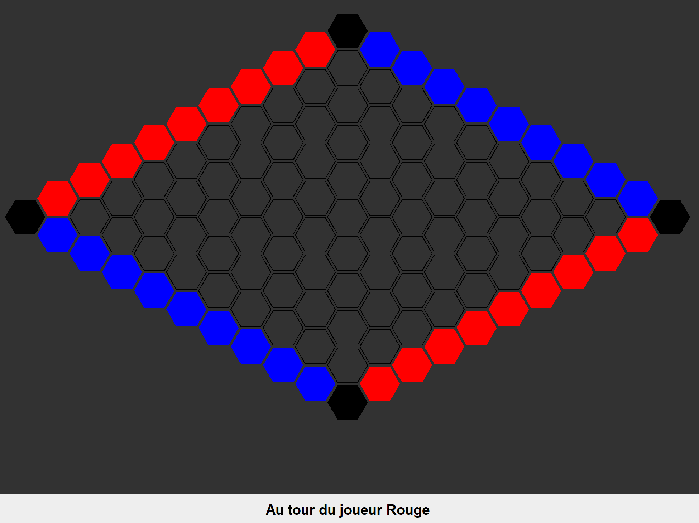

# Hex Game

Implémentation du jeu de société **Hex** en Java avec une interface graphique Swing.

## Règles du jeu

Le Hex se joue sur un plateau de 11×11 cases hexagonales entre deux joueurs :

- **Rouge** doit relier le bord **gauche** au bord **droit**
- **Bleu** doit relier le bord **haut** au bord **bas**

Les joueurs placent chacun leur tour un pion sur une case vide. Le premier à créer un chemin continu entre ses deux bords gagne.



## Lancer le jeu

```bash
javac Main.java
java Main
```

Un argument optionnel permet de choisir la taille jouable du plateau (par défaut 9) :

```bash
java Main 13
```

## Fonctionnalités

- Plateau hexagonal de taille configurable, avec hexagones redimensionnés automatiquement selon la fenêtre
- Détection automatique de la victoire (DFS) avec surbrillance du chemin gagnant
- Option de rejouer en fin de partie
