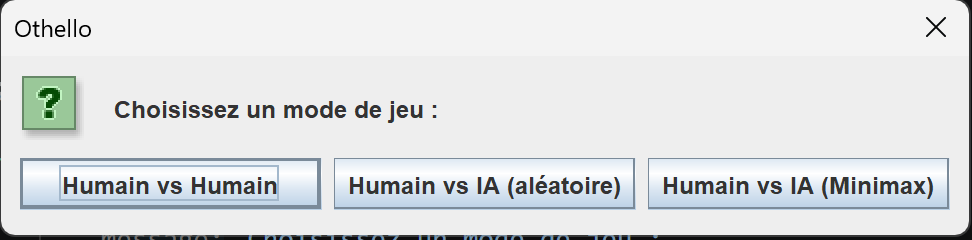
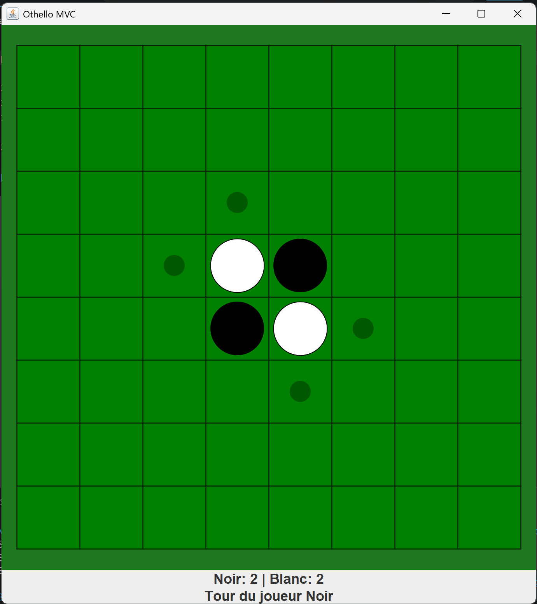

# ♟ Othello

Un jeu d'Othello (Reversi) entièrement jouable, développé en Java avec une architecture **MVC** (Modèle-Vue-Contrôleur) et une interface graphique Swing.




---

## Fonctionnalités

- **Trois modes de jeu** au choix au démarrage :
  - Humain vs Humain
  - Humain vs IA aléatoire
  - Humain vs IA Minimax (profondeur 6, avec élagage alpha-bêta)
- **Animations** de retournement des pièces
- **Affichage des coups valides** pour le joueur humain
- **Gestion automatique du passe-tour** si un joueur n'a aucun coup disponible
- **Détection de fin de partie** avec affichage du vainqueur et option de rejouer

---

## Structure du projet

```
src/
├── app/
│   └── Main.java               # Point d'entrée, sélection du mode de jeu
├── controller/
│   ├── GameMode.java           # Enum des trois modes de jeu
│   └── OthelloController.java  # Gestion des événements et coordination MVC
├── model/
│   ├── OthelloModel.java       # Logique du jeu (plateau, règles, tour)
│   ├── OthelloAI.java          # IA Minimax avec alpha-bêta
│   └── Piece.java              # Enum BLACK / WHITE / EMPTY
└── view/
    ├── OthelloView.java        # Fenêtre principale (JFrame)
    └── BoardPanel.java         # Rendu du plateau et animations
```

---

## Architecture MVC

| Couche | Rôle |
|---|---|
| **Modèle** (`OthelloModel`) | Etat du plateau, validation des coups, retournement, gestion des tours |
| **Vue** (`OthelloView` / `BoardPanel`) | Rendu graphique, animations, messages utilisateur |
| **Contrôleur** (`OthelloController`) | Écoute les clics souris, orchestre modèle ↔ vue, déclenche l'IA |

---

## Intelligence Artificielle

L'IA Minimax (`OthelloAI`) utilise :

- **Minimax** récursif avec **élagage alpha-bêta** (profondeur par défaut : 6)
- **Fonction d'évaluation** composite :
- *Pondération positionnelle* (coins = +100, cases adjacentes aux coins = −20/−50…)
- *Mobilité* (différence de coups disponibles entre les deux joueurs)
- *Parité* (différence de pièces, avec poids croissant en fin de partie)

---

## Prérequis & lancement

**Prérequis :** Java 17+ (utilisation de switch expressions)

```bash
# Compilation (depuis la racine du projet)
javac -d out -sourcepath src src/app/Main.java

# Exécution
java -cp out app.Main
```

Ou via votre IDE (IntelliJ, Eclipse, VS Code + Extension Pack for Java) en lançant `Main.java`.
