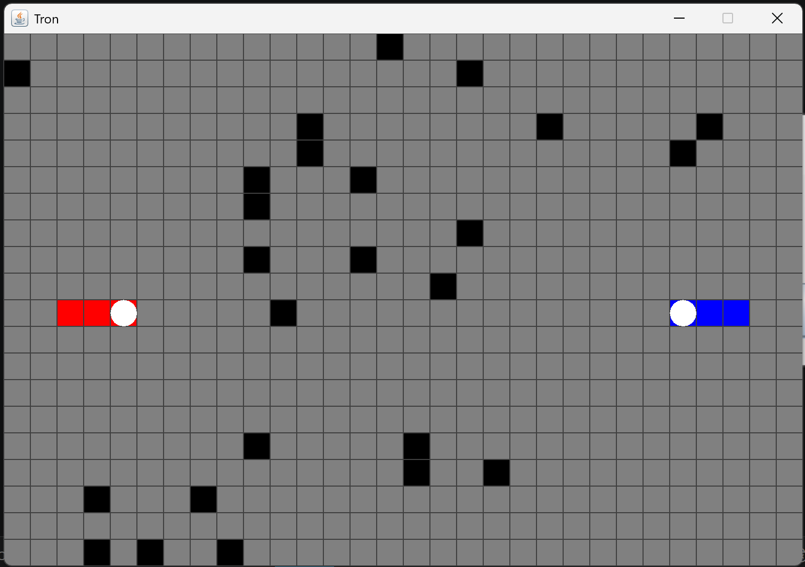

# 🏍️ Tron

Implémentation du jeu **Tron** en Java avec interface graphique Swing, suivant le pattern **MVC** (Modèle-Vue-Contrôleur).

---

## 📋 Description

Deux joueurs (ou une IA) se déplacent sur une grille et laissent une trace derrière eux. Le premier joueur à percuter un mur, un obstacle ou une trace perd la partie. La grille contient également des obstacles placés aléatoirement au départ.

---

## Aperçu



---

## 🎮 Modes de jeu

| Mode | Description |
|------|-------------|
| **Humain vs Humain** | Deux joueurs sur le même clavier |
| **Humain vs IA** | Un joueur humain affronte une IA qui le pourchasse |
| **IA vs IA** | Deux IA s'affrontent de façon autonome |

À la fin d'une partie, une boîte de dialogue propose de rejouer directement (nouvelle grille, même mode) sans relancer le programme.

---

## 🕹️ Contrôles

| Joueur | Haut | Bas | Gauche | Droite |
|--------|------|-----|--------|--------|
| Joueur 1 (Rouge) | `Z` | `S` | `Q` | `D` |
| Joueur 2 (Bleu) | `↑` | `↓` | `←` | `→` |

> Le retournement en sens inverse est interdit (on ne peut pas faire demi-tour).

---

## 🗂️ Structure du projet

```
├── app/
│   └── Main.java              # Point d'entrée, sélection du mode de jeu
├── controller/
│   ├── GameMode.java          # Enum des modes de jeu (PVP, PVE, EVE)
│   └── TronController.java   # Gestion des entrées clavier et de la boucle de jeu
├── model/
│   └── TronModel.java        # Logique du jeu, grille, déplacements, IA
└── view/
    ├── TronView.java          # Fenêtre principale (JFrame)
    └── BoardPanel.java        # Rendu graphique de la grille (JPanel)
```

---

## ⚙️ Architecture MVC

- **Modèle (`TronModel`)** — Contient l'état de la grille (20×30 cellules), les positions et directions des joueurs, la gestion des collisions, des obstacles et la logique de l'IA. Les deux joueurs avancent de façon strictement simultanée à chaque tour (`step`) : les collisions sont résolues sur l'état de la grille tel qu'il était avant que quiconque ne bouge, si bien qu'aucun joueur n'est avantagé par un ordre de traitement interne.
- **Vue (`TronView` + `BoardPanel`)** — Affiche la grille, les traces et les joueurs. Chaque cellule mesure 25×25 px. Les têtes des joueurs sont des cercles blancs ; un joueur mort reste affiché avec un repère en croix à l'endroit de la collision.
- **Contrôleur (`TronController`)** — Écoute les touches du clavier, pilote la boucle de jeu via un `javax.swing.Timer` et déclenche la fin de partie. La vitesse augmente progressivement au fil de la partie (intervalle initial de 500 ms, réduit par paliers jusqu'à un minimum de 150 ms).

---

## 🤖 Intelligence Artificielle

L'IA dispose de deux comportements selon le mode :

- **Mode chasse** (`Humain vs IA`) — L'IA choisit à chaque tour le mouvement qui minimise la distance de Manhattan avec le joueur adverse.
- **Mode survie** (`IA vs IA`) — Chaque IA choisit le mouvement qui maximise l'espace libre accessible (au lieu d'un choix purement aléatoire).

Dans les deux cas, l'IA évite les collisions immédiates et, via un remplissage par diffusion (flood fill) de l'espace accessible depuis chaque case candidate, évite autant que possible de s'enfermer dans une impasse lorsqu'une alternative plus sûre existe.

---

## 🗺️ Grille et affichage

| Élément | Couleur |
|---------|---------|
| Case vide | Gris |
| Trace Joueur 1 | Rouge |
| Trace Joueur 2 | Bleu |
| Obstacle | Noir |
| Tête des joueurs | Blanc (cercle) |

25 obstacles sont générés aléatoirement à l'initialisation, jamais à moins de 5 cases d'un joueur.

---

## 🚀 Lancement

### Prérequis

- Java 8 ou supérieur

### Compilation

```bash
javac -d out app/Main.java controller/GameMode.java controller/TronController.java model/TronModel.java view/TronView.java view/BoardPanel.java
```

### Exécution

```bash
java -cp out app.Main
```

---

## 📌 Règles de fin de partie

- Si un joueur percute un mur, un obstacle ou une trace → l'**autre joueur gagne**.
- Si les deux joueurs entrent en collision simultanément (y compris lorsqu'ils visent la même case libre au même tour) → **Égalité**.
