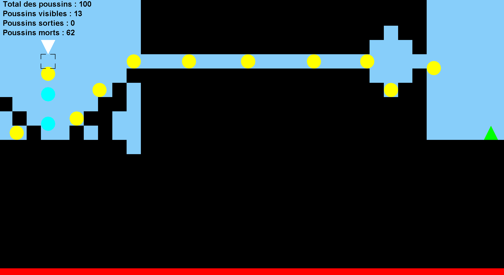

# 🐥 Chicks

> Clone de *Lemmings* en Java — sauvez vos poussins !

---

## Présentation

**Chicks** est un jeu de réflexion inspiré de *Lemmings*, développé en Java avec Swing.  
Des poussins apparaissent un par un depuis un portail d'entrée et marchent tout droit, sans se soucier du danger. Votre rôle : leur assigner des tâches pour les guider jusqu'au portail de sortie, en évitant la lave et les chutes mortelles.

<p align="center">
  
</p>

---

## Aperçu du gameplay

```
[Portail entrée] ──► poussins marchent automatiquement ──► [Portail sortie]
                          ↓ obstacles, vide, lave ↓
              Le joueur assigne des tâches pour les sauver
```

- **100 poussins** apparaissent progressivement (1 par seconde)
- Ils montent seuls les marches d'**une case** et font demi-tour devant un mur, un bloqueur ou le bord de l'écran
- Chaque poussin qui tombe de **5 cases ou plus** meurt
- La **lave** (en rouge, en bas du niveau) tue instantanément et ne peut pas être détruite
- La partie se termine une fois les 100 poussins apparus et plus aucun à l'écran (sortis ou morts)
- Un compteur en haut à gauche affiche le total, les poussins visibles, sortis et morts

---

## Tâches disponibles

| Tâche | Couleur | Rôle |
|---|---|---|
| 🧱 **Bloqueur** | Bleu nuit | Se fige en obstacle fixe qui fait faire demi-tour aux autres (le poussin est sacrifié et compté parmi les morts) |
| ⛏️ **Foreur** | Rose | Creuse vers le bas sur 5 cases |
| 🔨 **Charpentier** | Marron | Construit un escalier de 5 marches vers l'avant (s'arrête devant un obstacle, au bord de l'écran ou s'il fait demi-tour) |
| 🪖 **Tunnelier** | Gris | Perce le mur devant lui jusqu'à en ressortir |
| 🧗 **Grimpeur** | Magenta | Escalade le prochain mur au lieu de faire demi-tour, puis reprend sa marche au sommet |
| 🪂 **Parachutiste** | Cyan | Ralentit sa chute et survit à n'importe quelle hauteur |
| 💣 **Bombeur** | Orange | Explose après 3 cases, détruit les obstacles dans un rayon de 2 cases (sauf la lave) et meurt |

Un poussin sans tâche est **jaune**. Un poussin ne peut recevoir une nouvelle tâche qu'une fois la précédente terminée.

---

## Architecture MVC

```
src/
├── app/
│   └── Main.java                  # Point d'entrée, initialisation Swing
├── model/
│   ├── GameState.java             # Snapshot immuable de l'état du jeu
│   ├── SelectionModel.java        # Tâche sélectionnée par le joueur
│   ├── characters/
│   │   ├── GameCharacter.java     # Entité personnage (position, état, tâche)
│   │   ├── CharacterObserver.java # Interface observer (mort / sortie)
│   │   ├── PhysicsHelper.java     # Utilitaires physique (support, saut...)
│   │   ├── GameConfig.java        # Constantes globales (taille cellule, gravité...)
│   │   ├── states/                # Pattern State
│   │   │   ├── CharacterState.java
│   │   │   ├── Walking.java
│   │   │   ├── Falling.java
│   │   │   └── Jumping.java
│   │   └── tasks/                 # Pattern Strategy
│   │       ├── CharacterTask.java
│   │       ├── TaskType.java
│   │       ├── CellStepCounter.java # Détection de passage de case (Bombeur, Charpentier)
│   │       ├── Blocker.java
│   │       ├── Bomber.java
│   │       ├── Carpenter.java
│   │       ├── Climber.java
│   │       ├── Digger.java
│   │       ├── Parachutist.java
│   │       └── Tunneler.java
│   └── environment/
│       ├── Obstacle.java          # Grille de cellules (mur, blocker, lave)
│       └── Portal.java            # Portails d'entrée et de sortie
├── view/
│   ├── GameView.java              # Composant Swing principal
│   └── Renderer.java             # Logique de rendu (environnement, persos, stats)
└── controller/
    ├── GameController.java        # Boucle de jeu, timers, logique de fin
    ├── TaskController.java        # Application des tâches sur les personnages
    └── InputController.java       # Gestion souris (mouvement, clic)
```

---

## Patterns de conception utilisés

- **MVC** — séparation stricte Modèle / Vue / Contrôleur
- **State** — comportement du personnage (marche, chute, saut)
- **Strategy** — tâches interchangeables (`CharacterTask`)
- **Observer** — notification de fin de parcours d'un personnage : sortie atteinte ou mort (`CharacterObserver`)

---

## Prérequis & lancement

**Prérequis**
- Java 21 ou supérieur

**Compilation (depuis la racine du projet)**
```bash
javac -d out -sourcepath src src/app/Main.java
```

**Lancement**
```bash
java -cp out app.Main
```

---

## Contrôles

| Action | Effet |
|---|---|
| **Clic droit** sur le plateau | Ouvrir le menu de sélection de tâche |
| **Clic gauche** sur un poussin | Appliquer la tâche sélectionnée (elle reste sélectionnée pour les clics suivants) |
| Survol de la grille | Affiche le curseur de cellule |

---

## Conditions de fin

| Résultat | Condition |
|---|---|
| ✅ **Victoire** | Au moins 1 poussin atteint le portail de sortie (« Bravo ! Les poussins ont été sauvés ! ») |
| ❌ **Défaite** | Aucun poussin n'atteint la sortie (« Game Over, aucun poussin n'a été sauvé ! ») |
